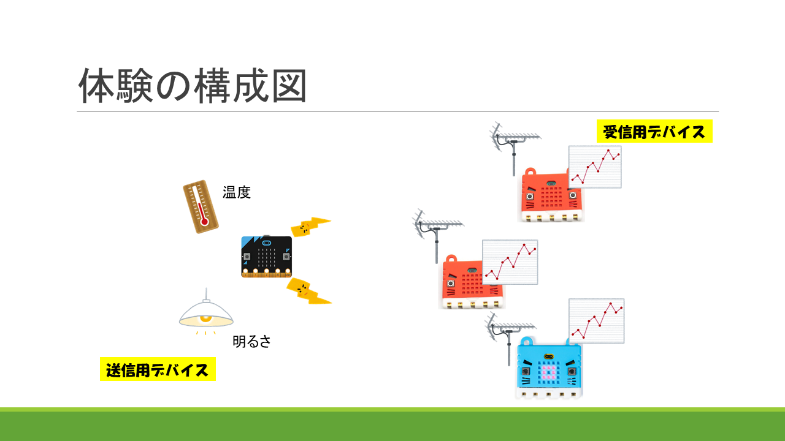

# センサからの情報収集

こちらは、真岡北稜高校体験授業のテキストになります。

栃木県立県央産業技術専門校 ITエンジニア科
    
## 体験の構成図

micro:bitを複数台用いて、実習を行います。
一台を送信用デバイスとして、無線通信により、温度センサ及び照度センサからの値を送信します。
各受信用デバイスには、無線通信により、送られてきた温度センサ及び照度センサの値をデータしてcsv形式にてダウンロードし、
Excelにてグラフにすることができる。

    

## ブロックのプレビュー

送信デバイスと受信デバイスの両方のブロックになっています。

