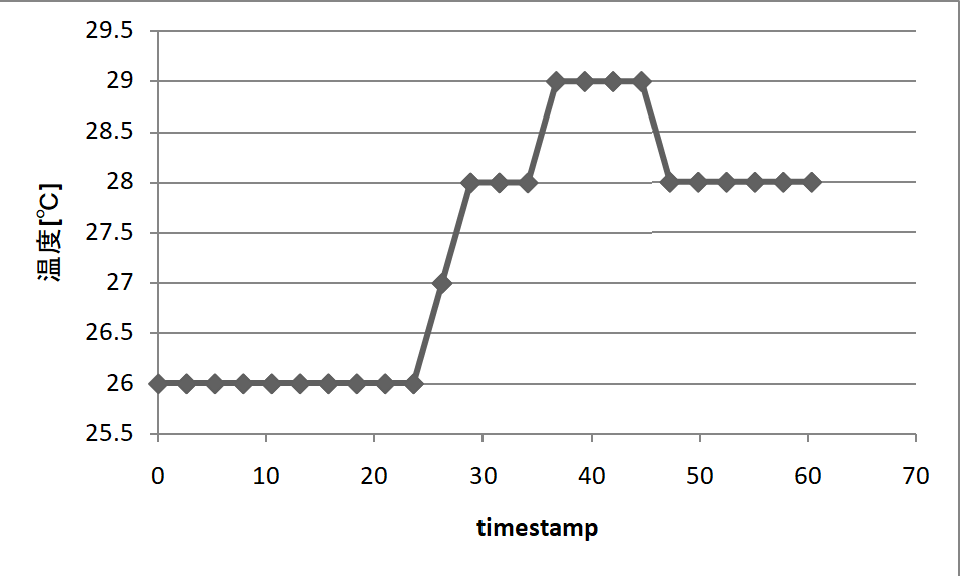
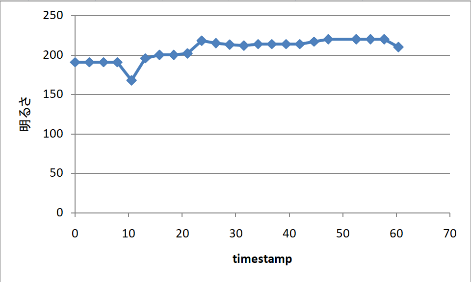

# センサからの情報収集

こちらは、体験授業での参考テキストになります。

栃木県立県央産業技術専門校 ITエンジニア科

## micro:bitから受信したデータを収集して、グラフにする

micro:bitに搭載されている温度センサと照度センサをからのデータをmicro:bit独自の通信規格を用いて、
２つのデータを送受信し、受け取ったデータをシリアル通信にて、コンソール画面で出力させます。
なお、出力されたデータはcsv形式のファイルとして、ダウンロード可能なため、Microsoft Excelにて、計測した時間帯のグラフを作成することができます。

| 温度センサ | 照度センサ |
|---|---|
| | |

### ・体験授業の構成図

micro:bitを複数台用いて、実習を行います。
一台を送信用デバイスとして、無線通信により、温度センサ及び照度センサからの値を送信します。
各受信用デバイスには、無線通信により、送られてきた温度センサ及び照度センサの値をデータしてcsv形式にてダウンロードし、
Excelにてグラフにすることができる。

### ・ブロックのプレビュー

送信デバイスと受信デバイスの両方のブロックになっています。

