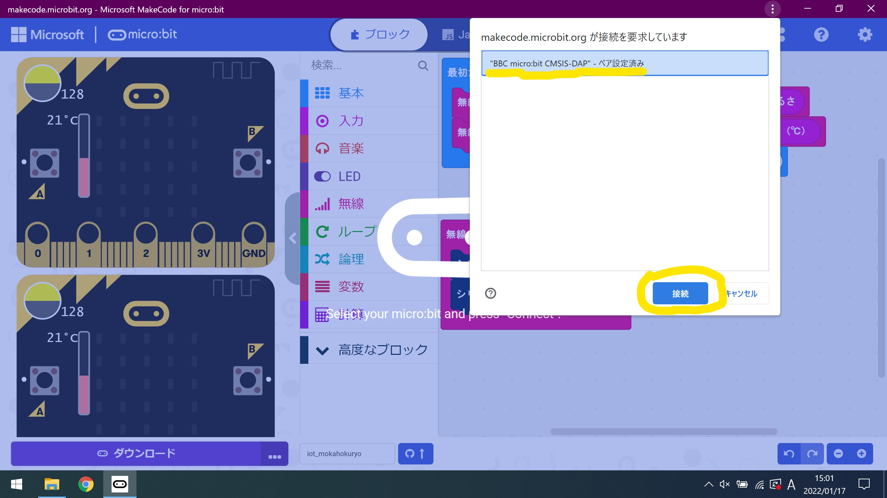

# micro:bitからのセンサデータの収集し、グラフにする

micro:bitに搭載されている温度センサと照度センサをからのデータをmicro:bit独自の通信規格を用いて、
送信し、受け取ったデータをシリアル通信にて、コンソール画面で出力させます。
なお、データをcsv形式にて、ダウンロード可能なため、Microsoft Excelにて、計測した時間帯のグラフを作成する。

## デバイスのペアリング方法

右上の歯車マークから「Connect Device」をクリックする。

    

次へ

    

次へ

    

USEBにて接続しているmicro:bitをIDを選択し、「接続」をクリックする。
複数接続している場合は、使用するmicro:bitを選択する。

    

