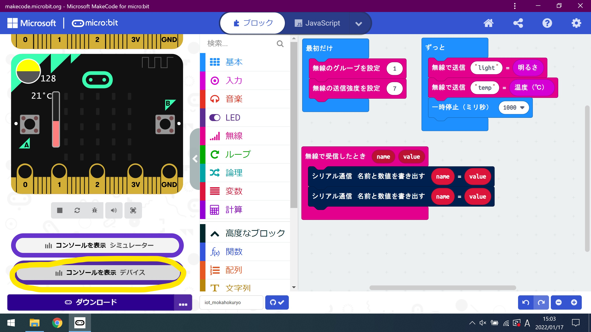

# micro:bitからのセンサデータの収集し、グラフにする

micro:bitに搭載されている温度センサと照度センサをからのデータをmicro:bit独自の通信規格を用いて、
送信し、受け取ったデータをシリアル通信にて、コンソール画面で出力させます。
なお、データをcsv形式にて、ダウンロード可能なため、Microsoft Excelにて、計測した時間帯のグラフを作成する。

## デバイスのペアリング方法

* 右上の歯車マークから「Connect Device」をクリックする。

    

* 次へ

    

* 次へ

    

* USEBにて接続しているmicro:bitをIDを選択し、「接続」をクリックする。
複数接続している場合は、使用するmicro:bitを選択する。

    

* 完了

    

## デバイスにプログラムを書き込む方法

* 左下の「ダウンロード」をクリックする。

    

## コンソールにて、波形の観測方法

* 左下の「コンソールを表示　デバイス」をクリックする。

    

正しく、データが取得できれば以下のような波形が出力される。

    

