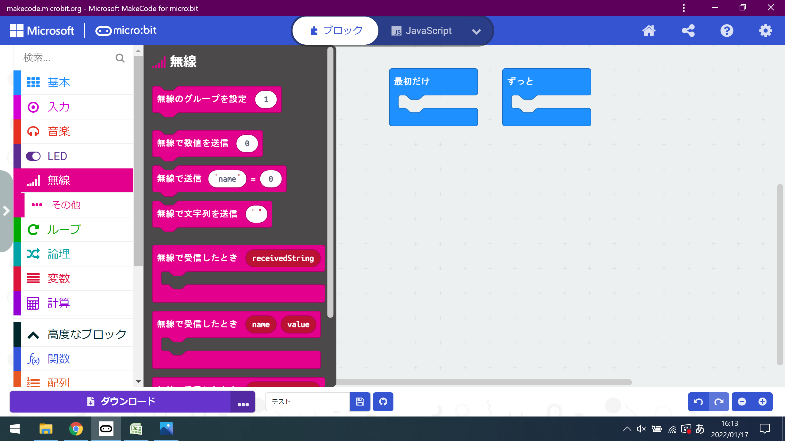
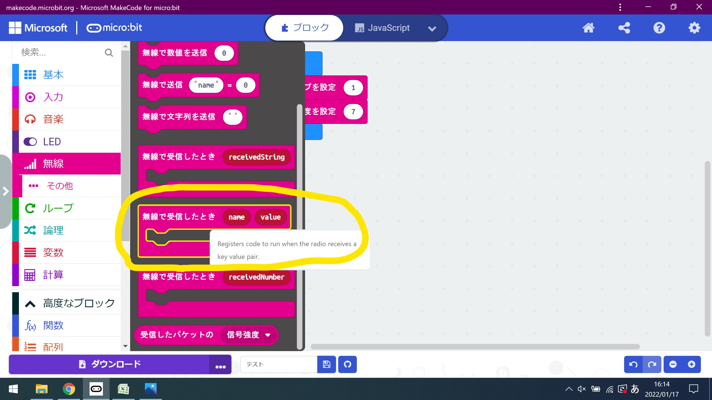
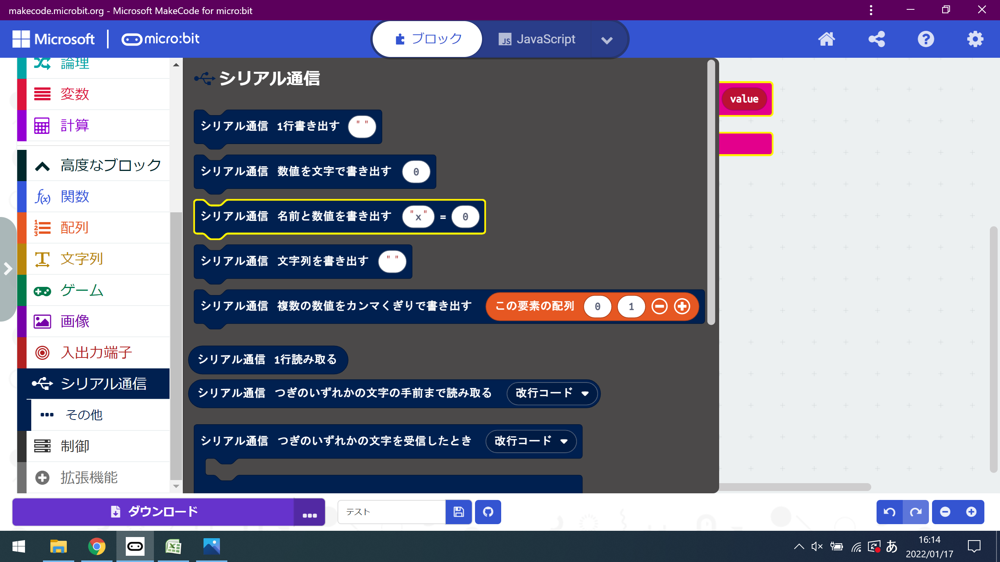
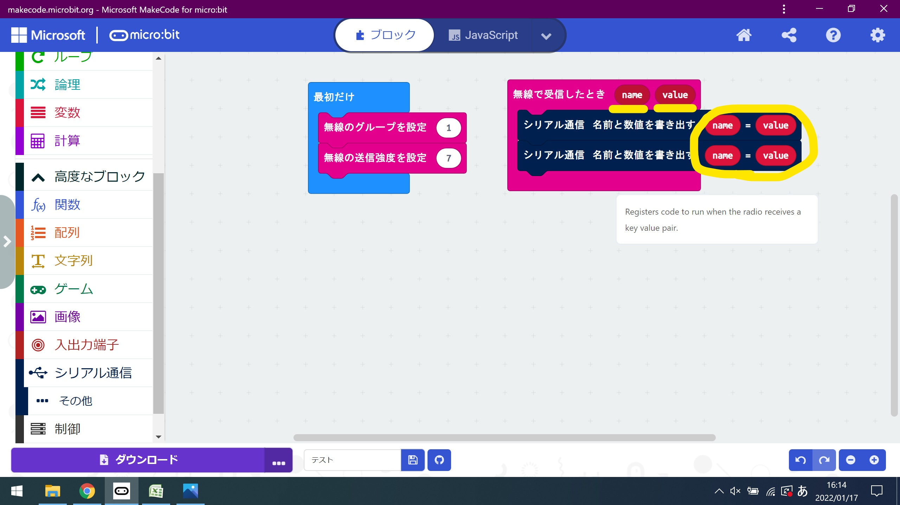

# makecodeにて、プログラムを作成する

ブロックをくっつけてプログラムを作成します。

完成図

    

「無線」カテゴリの中からから「無線のグループを設定」ブロック
「無線-その他」カテゴリの中から「無線の送信強度を設定」ブロックを
ドラッグ＆ドロップして、「最初に」ブロックにつなげる。

    

    

「無線」カテゴリの中から「無線で受信したとき」ブロックを
ドロップ＆ドロップする。

    

「シリアル通信」カテゴリの中から「シリアル通信-名前と数値を書き出す」ブロックを
ドラッグ＆ドロップして、「無線で受信したとき」ブロックにつなげる。
「name」と「value」をコピーして、貼り付ける。

    

    

「基本」カテゴリの中から「一時停止（ミリ秒）」ブロックを
ドラッグ＆ドロップして、「無線で受信したとき」ブロックにつなげて、数値を「1000」にする。

    

    

