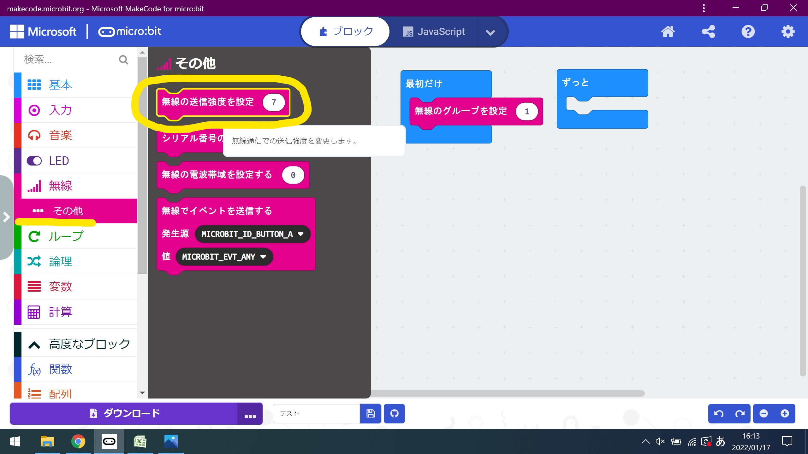
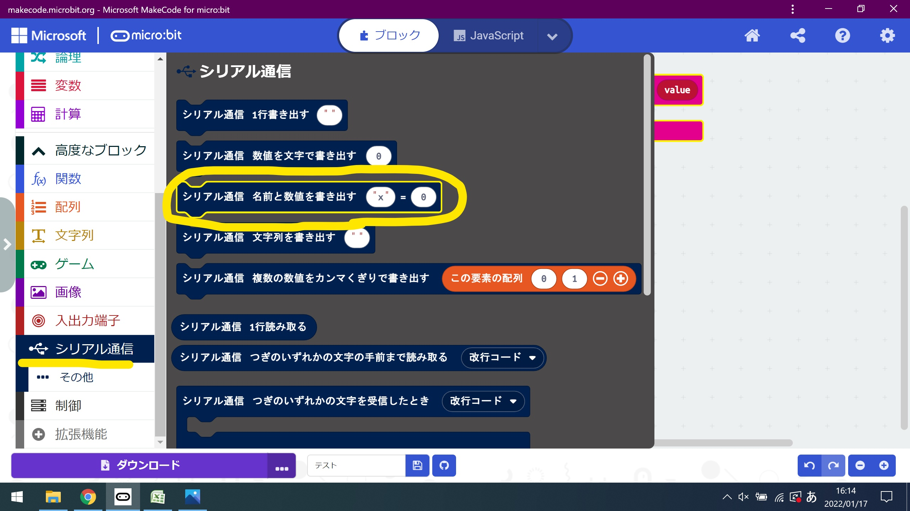
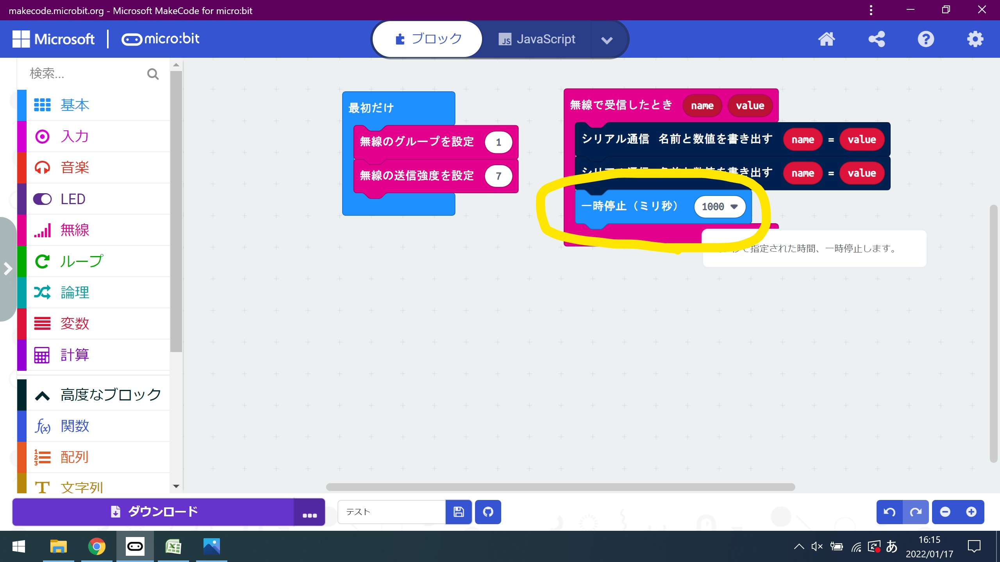
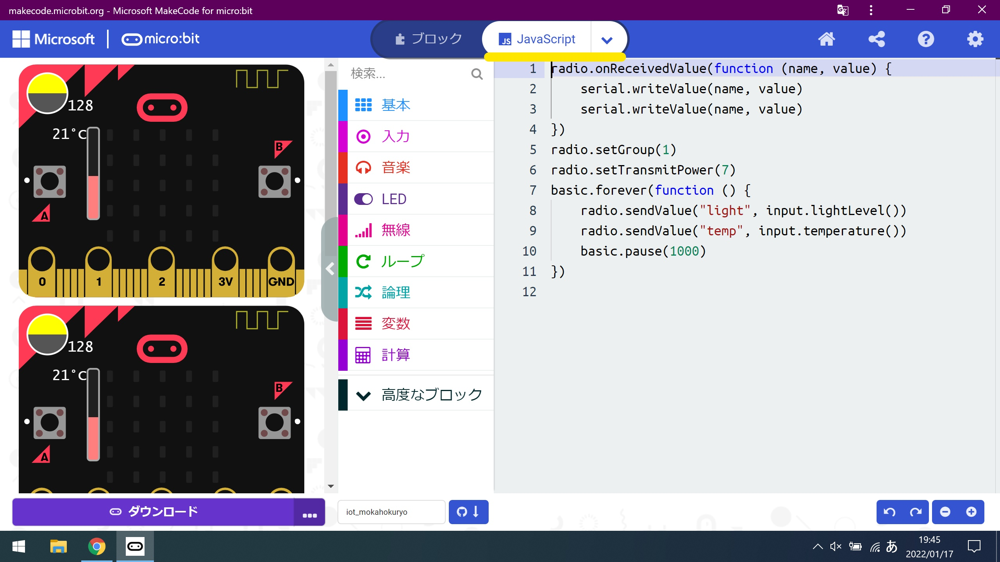

# プログラム作成

makecodeとjavascriptの二つの プログラミング作成方法を参照します。

## makecodeにて、プログラムを作成する

makecodeとは、ブロックをくっつけてプログラムを作成するツールです。
テキストエディタで行われるプログラミングをより直感的に操作できるため、
初心者に向いているプログラミング言語となっています。

[完成図]

<center>
    
</center>


・「無線」カテゴリの中からから「無線のグループを設定」ブロックを
「無線-その他」カテゴリの中から「無線の送信強度を設定」ブロックを
ドラッグ＆ドロップして、「最初に」ブロックにつなげる。

<center>
    
</center>

<center>
    
</center>


・「無線」カテゴリの中から「無線で受信したとき」ブロックを
ドロップ＆ドロップする。

<center>
    
</center>

・「シリアル通信」カテゴリの中から「シリアル通信-名前と数値を書き出す」ブロックを
ドラッグ＆ドロップして、「無線で受信したとき」ブロックにつなげる。
「name」と「value」をコピーして、貼り付ける。

<center>
    
</center>

<center>
    
</center>


・「基本」カテゴリの中から「一時停止（ミリ秒）」ブロックを
ドラッグ＆ドロップして、「無線で受信したとき」ブロックにつなげて、数値を「1000」にする。

<center>
    
</center>

<center>
    
</center>


## javascriptにて、プログラムを作成する

javascriptとは、テキストベースのプログラミング言語の一種です。
主にWebページの作成として使われる言語になっています。

以下のコードをコピーし、javascriptのエディタにペーストする。

<center>
    
</center>

```javascript

/**
 * 受信したデータをシリアル通信にて、コンソール画面に出力する。
 */
radio.onReceivedValue(function (name, value) {
    serial.writeValue(name, value)
    serial.writeValue(name, value)
})
/**
 * 無線のグループを1にする。
 * 
 * 無線通信の送信強度を7に設定
 */
radio.setGroup(1)
radio.setTransmitPower(7)

