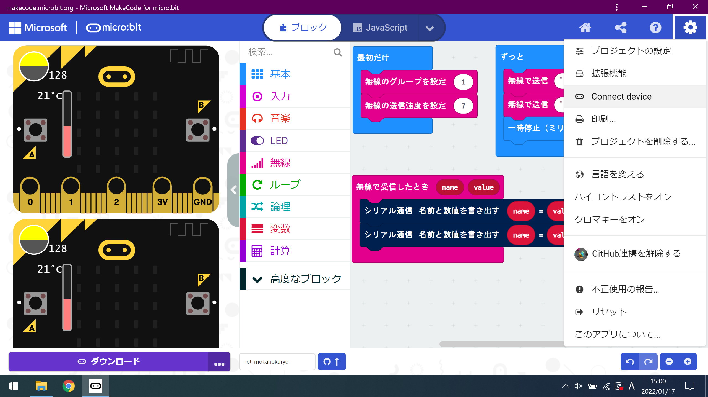
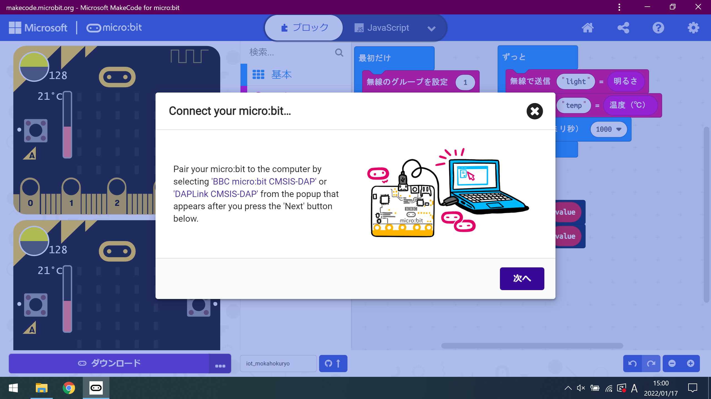
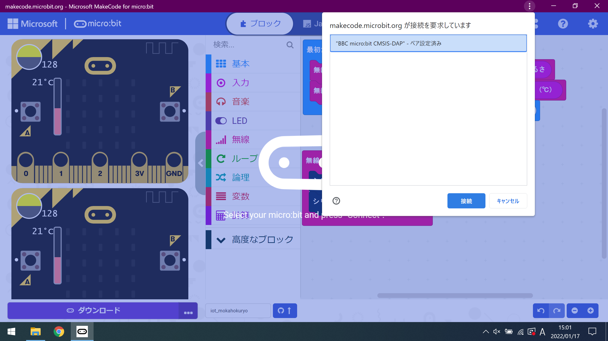
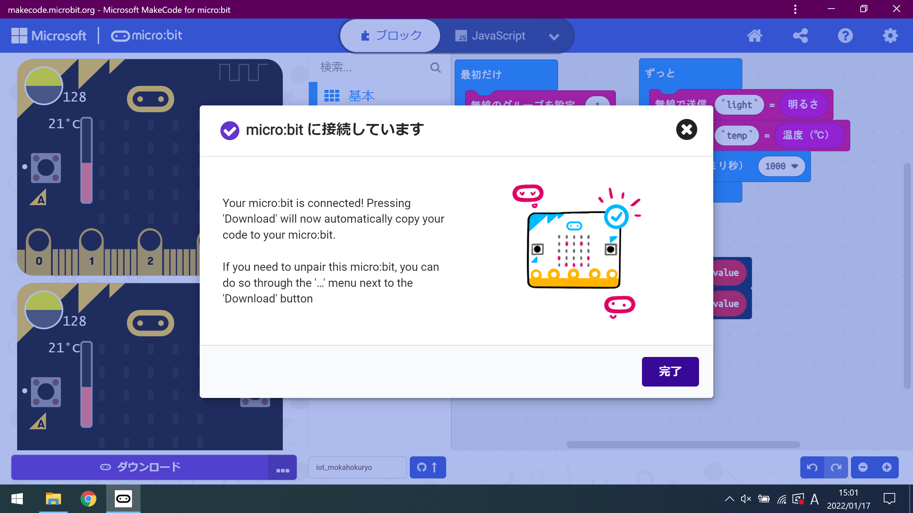
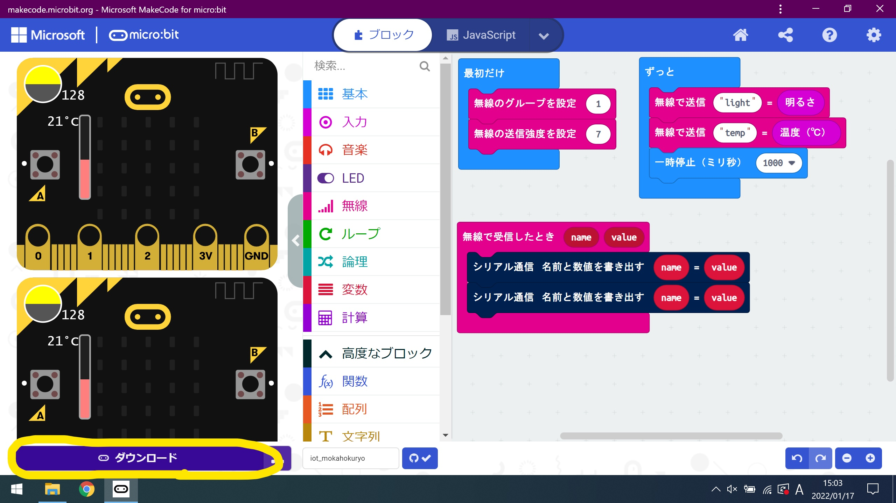
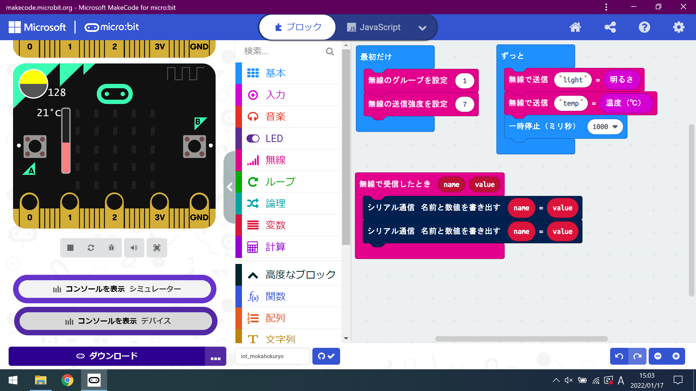
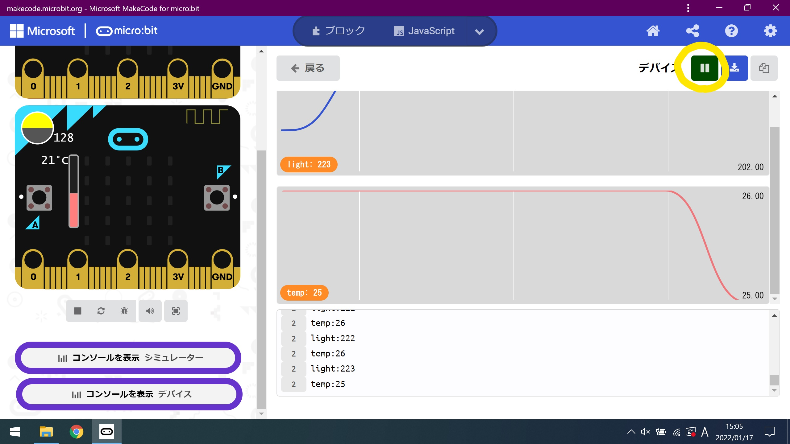

# micro:bitとPCを接続する

micro:bitに作成したプログラムをPCに転送するには、USBケーブルにて行います。
以下の作業を行う前に、micro:bitとPCをUSBケーブルにて接続しておきましょう。

## デバイスのペアリング方法

* 右上の歯車マークから「Connect Device」をクリックする。

    

* 次へ

    

* 次へ

    

* USEBケーブルにて接続しているmicro:bitをIDを選択し、「接続」をクリックする。
複数接続している場合は、使用するmicro:bitを選択する。

    

* 完了

    

## デバイスにプログラムを書き込む方法

* 左下の「ダウンロード」をクリックする。

    

## コンソールにて、波形の観測方法

* 左下の「コンソールを表示　デバイス」をクリックする。

    

正しく、データが取得できれば以下のような波形が出力される。

    

