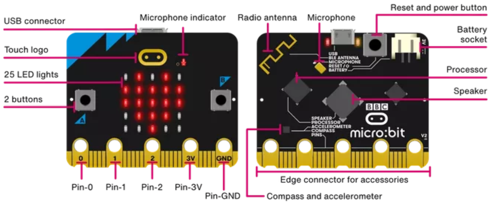
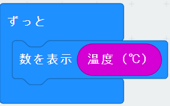
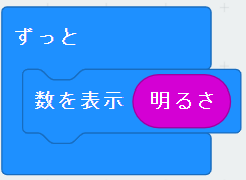

# センサからの情報収集

## micro:bitについて

micro:bitはイギリスのBBCが主体となって作った、手のひらサイズの教育向けマイコンボードです。
最新バージョンはv2.0となっています

### [micro:bitの主な機能](https://microbit.org/ja/get-started/user-guide/overview)

- 25個のチップLED
- 2個のボタンスイッチ
- スピーカ
- マイク
- 明るさセンサ
- 加速度センサ
- 磁器センサ
- 温度センサ
- 無線通信
- BLEを搭載

### 仕様

- MCU：32 bit ARM Cortex M4ベース Nordic nRF52833
  - 動作周波数：64 MHz
  - RAM：128 KB
  - BLE搭載
- LED × 25
- ボタンスイッチ × 2個
- タッチセンサ
- スピーカ
- マイク
- 加速度センサ
- 磁器センサ
- バッテリーコネクタ（JST製PHコネクタピン）
- サイズ：43 × 52 × 11mm（コネクタ部含む）
- 重さ：9g

### 外観図

外観は下図の通りとなる．

    

## オンチップ温度センサ

### 概要

|項目|v2.0|v1.5|
|:-:|:-:|:-:|
|タイプ|on-core NRF52|on-core nRF51|
|範囲測定|-40~105℃|-25~75℃|
|分解能|0.25℃steps|0.25℃steps|
|精度|+/-5℃|+/-4℃|

### makecode block

測定値として、温度値[℃]を得られます

    

## 環境光センサ

### 概要

|項目|v2.0|v1.5|
|:-:|:-:|:-:|
|タイプ|LED|LED|
|照度値|255段階|10段階|

### makecode block

光量として、0~254の255段階の値を得られます

    

