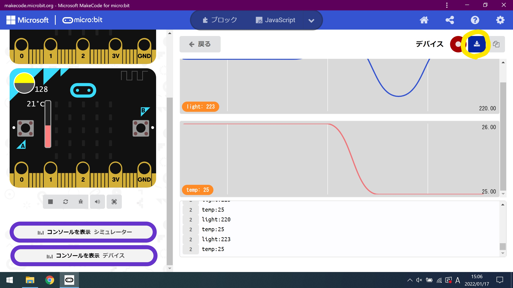
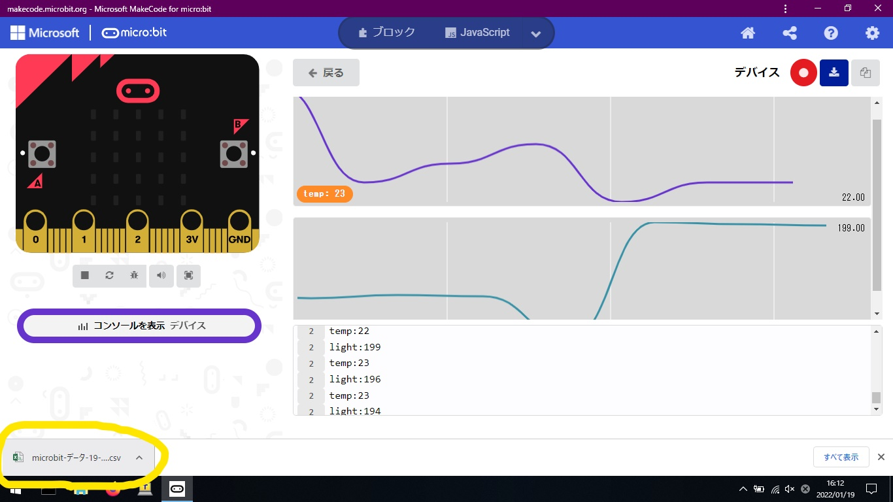
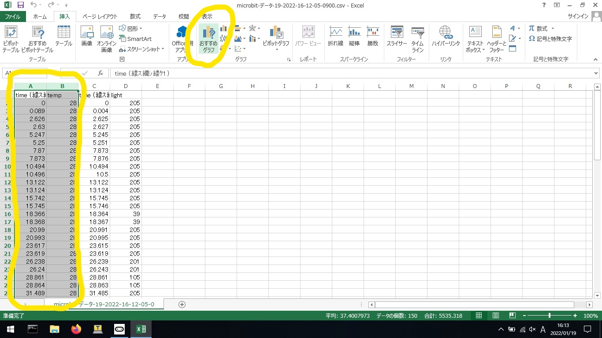
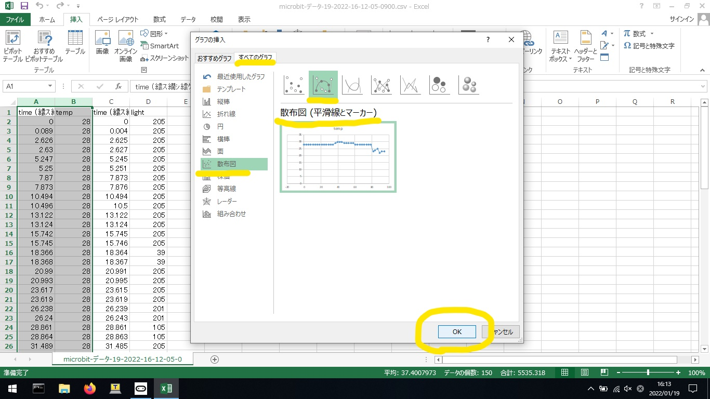
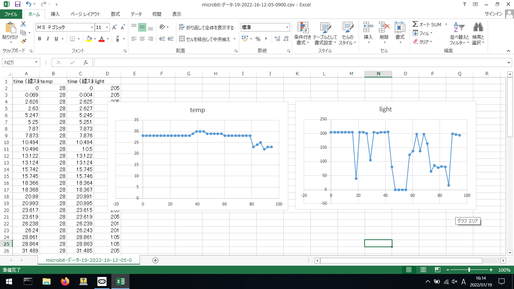

# センサからの情報収集

csv形式でダウンロードしたファイルをExcelで開くと、簡単にグラフにすることができます。
Microsoft Excelの機能を活用すれば、より高度な操作によるグラフ化を行えるが、今回は簡単な作成方法で行う。

## Excelによるグラフ化

### csv形式のファイルをダウンロードする

* 右上の「停止」をクリックする

    

* 右上の「エクスポート」をクリックする

    

### Excelにてファイルを開き、グラフにする

* 左下のファイルをクリックする

    

* A列・B列をクリックして範囲選択し、タブ欄から「挿入」-「おすすめグラフ」をクリックする

    

* タブ欄から「すべてのグラフ」-「散布図」-「散布図（平滑線とマーカー）」-「OK」をクリックする

    

C列・D列でも同様に作業を行うと、下図のようにグラフが生成される。

    

