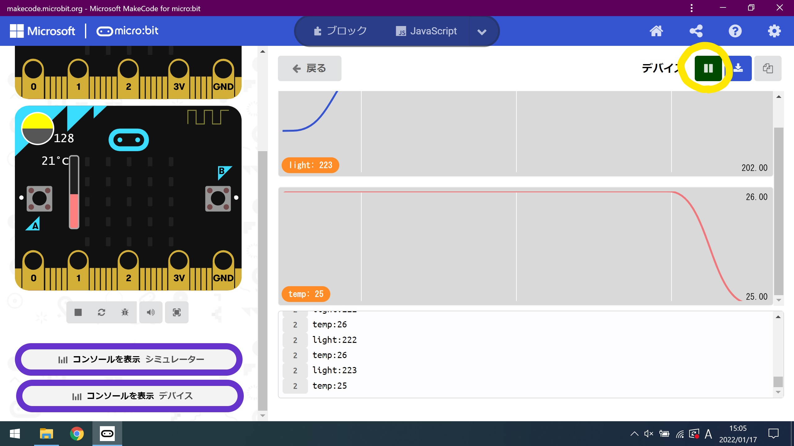

# センサからの情報収集

csv形式でダウンロードしたファイルをExcelで開くと、簡単にグラフにすることができます。

## Excelによるグラフ化

### csv形式のファイルをダウンロードする

* 右上の「停止」をクリックする

    

* 右上の「エクスポート」をクリックする

    

### Excelにて開く

* 左下のファイルをクリックする

    

* A列・B列をクリックして範囲選択し、タブ欄から「挿入」-「おすすめグラフ」をクリックする

    

* 

    

